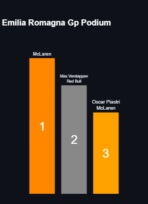
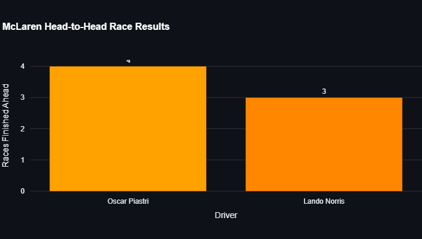
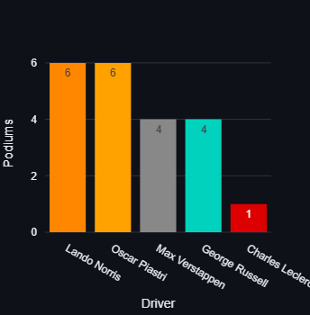
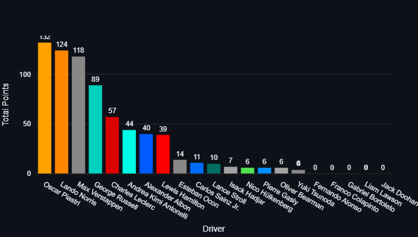
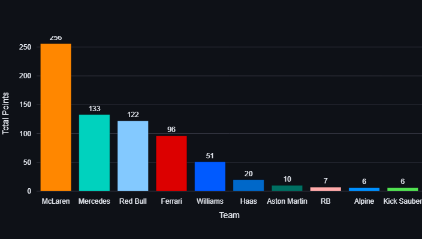
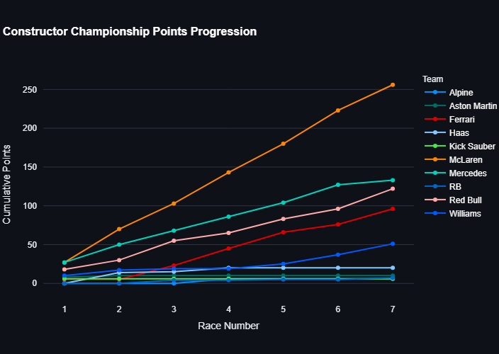

# F1-Streamlit-Data-Pipeline

A comprehensive Formula 1 2025 Season Dashboard built with Streamlit, providing real-time insights into driver performance, team standings, and race results.


## Table of Contents

- [Overview](#overview)
- [Features](#features)
- [Data Sources](#data-sources)
- [Dashboard Components](#dashboard-components)
- [Installation](#installation)
- [Usage](#usage)
- [Dashboard Screenshots](#dashboard-screenshots)
- [Project Structure](#project-structure)
- [Future Enhancements](#future-enhancements)
- [Contributing](#contributing)

## Overview

This project is a data visualization dashboard for the Formula 1 2025 season, built using Streamlit and Python. The dashboard provides comprehensive insights into the F1 season, including driver standings, team performance, detailed race analysis, and season progression visualizations.

The dashboard features two versions:

- **Extensive Dashboard** (`f1_dashboard_extensive.py`): A full-featured dashboard with interactive elements and detailed visualizations
- **Simple Dashboard** (`f1_dashboard_simple.py`): A streamlined version with basic stats and simplified charts

## Features

- **Real-time F1 Season Stats**: Track the 2025 Formula 1 season with up-to-date race results
- **Interactive Filtering**: Filter data by race, team, and other parameters
- **Multi-tab Interface**: Organized sections for different aspects of F1 data
- **Dynamic Visualizations**: Responsive charts and graphs that update based on user selection
- **Team & Driver Comparisons**: Head-to-head analysis of teams and drivers
- **Season Progression Tracking**: Visual representation of how standings evolve throughout the season
- **Podium Visualizations**: Graphical representation of race podiums

## Data Sources

The dashboard uses two primary CSV data sources:

1. **F1 Race Results** (`f1_race_results_2025.csv`): Contains detailed race results including:

   - Driver positions
   - Lap times
   - Points earned
   - Race names and locations

2. **F1 Drivers List** (`f1_drivers_list_2025.csv`): Contains information about drivers:
   - Driver number
   - Driver abbreviation
   - Full name
   - Team affiliation

## Dashboard Components

### 1. Driver Stats Tab

- Total points by driver
- Race wins distribution
- Podium finishes
- Average finishing positions

### 2. Team Performance Tab

- Constructor championship points
- Average finish position by team
- Teammate comparison with head-to-head race results

### 3. Race Analysis Tab

- Individual race results
- Podium visualization for each race
- Position changes

### 4. Season Progress Tab

- Driver championship points progression throughout the season
- Constructor championship evolution
- Performance trend analysis

## Installation

Clone the repository
```
git clone https://github.com/frankndungu/f1-streamlit-data-pipeline.git
```

```
cd f1-streamlit-data-pipeline
```
Create and activate virtual environment

```
python -m venv venv
```
```
source venv/bin/activate 
```

Install dependencies
```
pip install -r requirements.txt
```

## Usage

To run the extensive dashboard:

```bash
streamlit run f1_dashboard_extensive.py
```

To run the simple dashboard:

```bash
streamlit run f1_dashboard_simple.py
```

Access the dashboard in your web browser at `http://localhost:8501`.

## Dashboard Screenshots

### Driver Championship Points Progression


### Emilia Romagna GP Podium



### McLaren Head-to-Head Race Results



### Driver Podiums



### Total Driver Points



### Team Constructor Points



### Team Season Progression



## Project Structure

```
f1-streamlit-data-pipeline/
├── f1_dashboard_extensive.py     # Main comprehensive dashboard
├── f1_dashboard_simple.py        # Simplified dashboard version
├── f1_race_results_2025.csv      # Race results data
├── f1_drivers_list_2025.csv      # Driver information data
├── images/                       # Dashboard screenshots
├── requirements.txt              # Project dependencies
└── README.md                     # Project documentation
```

## Key Dashboard Features

### Extensive Dashboard (`f1_dashboard_extensive.py`)

- Uses Plotly for interactive visualizations
- Multi-tab interface with comprehensive data views
- Team color mapping for consistent visual identity
- Detailed filtering options in sidebar
- Custom styling with F1 theme
- Teammate head-to-head comparisons
- Race-by-race progression charts

### Simple Dashboard (`f1_dashboard_simple.py`)

- Uses Matplotlib/Seaborn for basic visualizations
- Simplified interface with core stats only
- Streamlined experience for quick insights
- Minimal filtering
- Basic styling

## Future Enhancements

- Live data integration with Fast F1 API
- Predictive modeling for race outcomes
- Driver performance analytics
- Qualifying data integration
- Historical season comparisons
- Pit stop strategy analysis
- Interactive track maps
- Factor in tire degradation

## Contributing

Contributions are welcome! Please feel free to submit a Pull Request.

1. Fork the repository
2. Create your feature branch
3. Commit your changes
4. Push to the branch 
5. Open a Pull Request

## License

This project is licensed under the MIT License - see the LICENSE file for details.
